# Emergency Dashboard

A facilitator-controlled Plotly Dash dashboard for the Kajini One Health leadership simulation exercise.

The dashboard is designed to help participants see how decisions affect an emerging zoonotic outbreak and the wider response system. It is a structured decision-and-consequence tool, not a predictive epidemiological model.

## Exercise purpose

The simulation places participants in a fast-moving outbreak involving:

- Human cases and deaths
- Cattle deaths and livelihood disruption
- Healthcare-worker safety and hospital pressure
- Community resistance and farmer cooperation
- Misinformation and communication pressure
- Resource competition and political pressure

Participants make decisions under uncertainty using an OODA/VUCA approach:

1. Observe what has changed
2. Orient to uncertainty, complexity and ambiguity
3. Decide what cannot wait
4. Act by assigning responsibilities and next steps

The dashboard helps facilitators visualise plausible consequences of action, delay or fragmented coordination.

## Dashboard structure

### Central map

The map is a fictional operational map of Kajini with seven regions:

- Area 1: Northern Highlands
- Area 2: Western Farms
- Area 3: Central Capital
- Area 4: Eastern Corridor
- Area 5: Lakeside Communities
- Area 6: Southern Plains
- Area 7: Southern Borderlands

Regions are coloured according to the scenario's regional case burden. The map also shows operational traces:

- Black circles: functioning response capacity, including the national laboratory and regional hospitals
- Red X: active problems, currently including farmer resistance

The map is intentionally fictional and schematic. It should not be interpreted as official Kajini geography.

### Right-side tabs

#### Outbreak & health

- Daily human cases
- Cumulative human deaths
- Test positivity
- Cattle deaths
- Hospital capacity used

#### Clinical data

- Age/sex patient pyramid
- Clinical symptom profile
- Cumulative mortality rate

#### Context

Facilitator-assessed response factors are shown as diverging bars:

- Community trust
- Coordination quality
- Healthcare-worker safety
- Misinformation pressure
- Resource pressure

Negative conditions extend to the left in red. Positive conditions extend to the right in green. The underlying scores are not shown to participants, but are maintained internally on a `-2` to `+2` scale.

## Simulation clock and decision points

The simulation runs for 30 simulated days. The speed is controlled by:

```python
DAY_INTERVAL_MS = 1_000
```

This means one simulated day every second. The value is in milliseconds:

```python
DAY_INTERVAL_MS = 10_000  # 10 seconds per simulated day
DAY_INTERVAL_MS = 1_000   # 1 second per simulated day
DAY_INTERVAL_MS = 500     # 0.5 seconds per simulated day
```

The clock pauses at Days 10, 20 and 30. At each pause, the facilitator receives a transition question and selects one of two neutral scenario pathways.

The question wording and scenario labels are defined in the `DECISION_EFFECTS` section of `app.py`.

Examples include:

- Coordinated early action versus partial or fragmented action
- Trust-building engagement versus limited community engagement
- Transparent prioritisation versus unresolved competing priorities

The labels are intentionally descriptive rather than calling one option “good” and the other “bad”.

### Decision-flow diagram

The questions are transition points rather than separate exercise rounds. The clock runs until a transition day, pauses for facilitator judgement, then resumes after a scenario is selected.

```mermaid
flowchart LR
    A[Day 0–10<br/>The signal] --> Q1{Day 10 question:<br/>How was early surveillance and healthcare-worker protection established?}
    Q1 --> A1[Scenario A:<br/>Coordinated early action]
    Q1 --> B1[Scenario B:<br/>Partial or fragmented action]
    A1 --> F1[Update context factors<br/>Trust, coordination,<br/>healthcare safety, misinformation, resources]
    B1 --> F1
    F1 --> C[Day 10–20<br/>Trust under pressure]
    C --> Q2{Day 20 question:<br/>How did the response engage communities and support farmer cooperation?}
    Q2 --> A2[Scenario A:<br/>Trust-building engagement]
    Q2 --> B2[Scenario B:<br/>Limited community engagement]
    A2 --> F2[Accumulate factor changes]
    B2 --> F2
    F2 --> D[Day 20–30<br/>International escalation and crisis management]
    D --> Q3{Day 30 question:<br/>How were scarce resources prioritised to protect lives and essential services?}
    Q3 --> A3[Scenario A:<br/>Transparent prioritisation]
    Q3 --> B3[Scenario B:<br/>Competing priorities unresolved]
    A3 --> END[Final dashboard state<br/>Cases, deaths, hospital capacity<br/>and context factors]
    B3 --> END
```



Each selection updates the accumulated context state. The context state then influences the illustrative outcome trajectories shown in the dashboard.

## Consequence model

The editable model is marked in `app.py` with:

```python
# USER-EDITABLE CONSEQUENCE MODEL
```

The model maintains response-factor scores for:

- Community trust
- Coordination quality
- Healthcare-worker safety
- Misinformation pressure
- Resource pressure

Each submitted scenario applies effects to these factors. Effects accumulate across the exercise and are capped between `-2` and `+2`.

The factors influence the outcome indicators through simple transparent adjustments to the baseline scenario data:

- Daily cases
- Cattle deaths
- Human deaths
- Hospital capacity

The model is deliberately simple so facilitators can understand and modify it. The coefficients are exercise assumptions, not calibrated estimates of real-world transmission or mortality.

## Running the app

From the project directory, activate the virtual environment:

```powershell
.\.venv\Scripts\Activate.ps1
```

Install dependencies if needed:

```powershell
pip install -r requirements.txt
```

Start the dashboard:

```powershell
python app.py
```

Open the local address shown in the terminal, usually:

```text
http://127.0.0.1:8050/
```

## Files

```text
app.py                         Main Dash application and editable model
assets/dashboard.css           Dashboard styling
data/kajini_map.geojson        Fictional Kajini map
requirements.txt               Python dependencies
Reference/                     Exercise notes and reference materials
```

## Facilitator workflow

1. Start the dashboard before the exercise.
2. Confirm the scenario title, map and simulation speed.
3. Use the dashboard during each exercise round.
4. Review participant decision cards.
5. Allow the simulation clock to reach the next decision point.
6. Read the transition question.
7. Select the scenario pathway that best reflects the group decisions.
8. Submit the decision and allow the simulation to continue.
9. Use the Outbreak, Clinical and Context tabs during the plenary review.
10. Use the final dashboard state to support the debrief.

## Important interpretation note

All values in the dashboard are illustrative scenario values. The dashboard should be presented as a facilitator-controlled consequence display. It should not be described as an AI system, a clinical decision-support system or a validated outbreak forecast.
